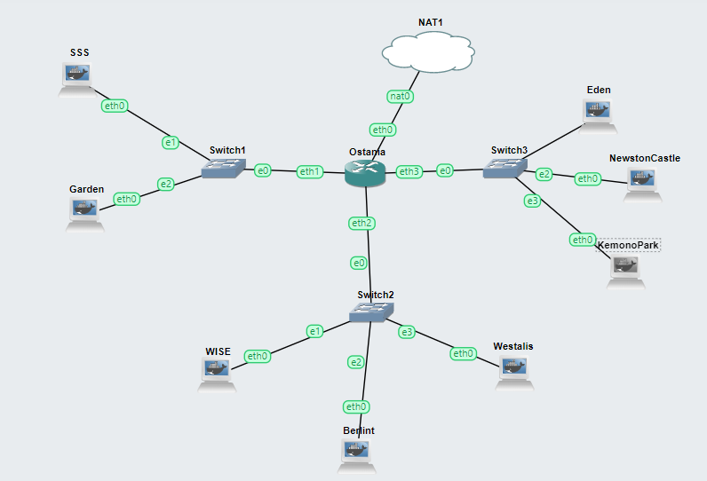

# Jarkom-Modul-3-ITB05-2022
Kelompok ITB05

1. M.Fernando N.Sibarani (5027201015)
2. Richard Nicolas (5027201021)
3. Muhammad Ihsanul Afkar (5027201024)


# Daftar Isi
* [Topologi](#Topologi)
* [Soal 1](#soal-1) 
* [Soal 2](#soal-2) 
* [Soal 3](#soal-3) 
* [Soal 4](#soal-4) 
* [Soal 5](#soal-5) 
* [Soal 6](#soal-6) 
* [Soal 7](#soal-7) 
* [Soal 8](#soal-8) 
* [Kendala](#kendala)

# Topologi


# Soal-1
Loid bersama Franky berencana membuat peta tersebut dengan kriteria **WISE** sebagai DNS Server, **Westalis** sebagai DHCP Server, **Berlint** sebagai Proxy Server
## Penyelesaian Soal 1
Topologi yang kami gunakan adalah modifikasi dari topologi modul 2 sebelumnya, berikut ini ada topologi yang kami buat


# Soal-2
**Ostania** sebagai DHCP Relay. Loid dan Franky menyusun peta tersebut dengan hati-hati dan teliti.
## Penyelesaian Soal 2
Untuk membuat **Ostania** menjadi DHCP Relay, Pertama kami install DHCP relay dengan cara berikut ini
```
apt-get update
apt-get install isc-dhcp-relay -y
```
Kemudian dimasukkan setting **SERVERS**, **INTERFACES**, dan **OPTIONS** ke `/etc/default/isc-dhcp-relay` dan direstart dhcp relaynya dengan `service isc-dhcp-relay restart`
```
echo "SERVERS=\"10.47.2.4\"
INTERFACES=\"eth1 eth3 eth2\"
OPTIONS=\"\"" > /etc/default/isc-dhcp-relay
service isc-dhcp-relay restart
```
**SERVERS** yang dimaksud adalah DHCP server dengan IP **10.47.2.4**

Pengecekan **DHCP relay** dilakukan dengan `dhcrelay --version`, dan hasilnya adalah sebagai berikut ini


# Soal-3
Ada beberapa kriteria yang ingin dibuat oleh Loid dan Franky, yaitu:
1. Semua client yang ada **HARUS** menggunakan konfigurasi IP dari DHCP Server.
2. Client yang melalui Switch1 mendapatkan range IP dari 10.47.1.50 - 10.47.1.88 dan 10.47.1.120 - 10.47.1.155
## Penyelesaian Soal 3
Agar semua node dapat diberikan IP otomatis oleh DHCP Server, maka konfigurasi **network configuration** pada **DHCP Client** adalah sebagai berikut 
```
auto eth0
iface eth0 inet dhcp
```
Pada node **Westalis** akan dilakukan install **DHCP server** dengan cara berikut ini 
```
apt-get update
apt-get install isc-dchp-server -y
```
Setelah itu disetting **INTERFACES** nya pada `/etc/default/isc-dhcp-server` dengan cara seperti berikut ini
```
echo "INTERFACES=\"eth0\"" > /etc/default/isc-dhcp-server
```
Selanjutnya pada `/etc/dhcp/dhcpd.conf` dimasukkan konfigurasi sebagai berikut ini
```
echo "subnet 10.47.2.0 netmask 255.255.255.0 {
}
subnet 10.47.1.0 netmask 255.255.255.0 {
    range 10.47.1.50 10.47.1.88;
    range 10.47.1.120 10.47.1.155;
    option routers 10.47.1.1;
    option broadcast-address 10.47.1.255;
    option domain-name-servers 10.47.2.2;
    default-lease-time 300;
    max-lease-time 6900;
}
subnet 10.47.3.0 netmask 255.255.255.0 {
    range  10.47.3.10 10.47.3.30;
    range  10.47.3.60 10.47.3.85;
    option routers 10.47.3.1;
    option broadcast-address 10.47.3.255;
    option domain-name-servers 10.47.2.2;
    default-lease-time 600;
    max-lease-time 6900;
}
host Eden {
    hardware ethernet 52:d7:62:29:f2:7f;
    fixed-address 10.47.3.13;
}
" > /etc/dhcp/dhcpd.conf
service isc-dhcp-server restart
```
Pengecekan **DHCP server** dapat dilakukan dengan `service isc-dhcp-server status`, dan hasilnya adalah sebagai berikut ini


Dikarenakan pada **10.47.2.0** tidak diperlukan DHCP karena isinya adalah semua server, maka subnet tersebut dikosongkan

Untuk subnet **10.47.1.0** konfigurasinya adalah sebagai berikut
```
subnet 10.47.1.0 netmask 255.255.255.0 {
    range 10.47.1.50 10.47.1.88;
    range 10.47.1.120 10.47.1.155;
    option routers 10.47.1.1;
    option broadcast-address 10.47.1.255;
    option domain-name-servers 10.47.2.2;
    default-lease-time 300;
    max-lease-time 6900;
}
```
range menunjukan IP adress yang bisa diberikan untuk setiap devices yang melalui subnet tersebut (**10.47.1.50** sampai **10.47.1.88** dan **10.47.1.120** sampai **10.47.1.155**)

Untuk **routers** dan **broadcast-address** disesuaikan dengan subnetnya (routernya **10.47.1.1** dan broadcastnya **10.47.1.255**)

Domain name server yang digunakan adalah **WISE** dengan IP **10.47.2.2** (pada option domain-name-servers 10.47.2.2)

Hasil pada node **Garden**


Hasil pada node **SSS**


# Soal-4 
## (Revisi)
3. Client yang melalui Switch3 mendapatkan range IP dari 10.47.3.10 - 10.47.3.30 dan 10.47.3.60 - 10.47.3.85
## Penyelesaian Soal 4
Untuk subnet **10.47.3.0** konfigurasinya adalah sebagai berikut
```
subnet 10.47.3.0 netmask 255.255.255.0 {
    range  10.47.3.10 10.47.3.30;
    range  10.47.3.60 10.47.3.85;
    option routers 10.47.3.1;
    option broadcast-address 10.47.3.255;
    option domain-name-servers 10.47.2.2;
    default-lease-time 600;
    max-lease-time 6900;
}
```
range menunjukan IP adress yang bisa diberikan untuk setiap devices yang melalui subnet tersebut (**10.47.3.10** sampai **10.47.3.30** dan **10.47.3.60** sampai **10.47.3.85**)

Untuk **routers** dan **broadcast-address** disesuaikan dengan subnetnya (routernya **10.47.3.1** dan broadcastnya **10.47.3.255**)

Domain name server yang digunakan adalah **WISE** dengan IP **10.47.2.2** (pada option domain-name-servers 10.47.2.2)

Setelah disetting seperti itu, maka DHCP server akan  di-*restart* dengan perintah `service isc-dhcp-server restart`
Hasil pada node **NewstonCastle**


Hasil pada node **KemonoPark**


# Soal-5

4. Client mendapatkan DNS dari WISE dan client dapat terhubung dengan internet melalui DNS tersebut.

## Penyelesaian Soal 5

File **/etc/bind/named.conf.options** pada WISE disetting sebagai berikut

```bash
options {
        directory "/var/cache/bind";

        // If there is a firewall between you and nameservers you want
        // to talk to, you may need to fix the firewall to allow multiple
        // ports to talk.  See http://www.kb.cert.org/vuls/id/800113

        // If your ISP provided one or more IP addresses for stable
        // nameservers, you probably want to use them as forwarders.
        // Uncomment the following block, and insert the addresses replacing

        forwarders {
                8.8.8.8; 
                8.8.4.4;
        // };

        //dnssec-validation auto;
        allow-query{any;};

        auth-nxdomain no;    # conform to RFC1035
        listen-on-v6 { any; };
};
```

**Testing**


# Soal-6

5. Lama waktu DHCP server meminjamkan alamat IP kepada Client yang melalui Switch1 selama 5 menit sedangkan pada client yang melalui Switch3 selama 10 menit. Dengan waktu maksimal yang dialokasikan untuk peminjaman alamat IP selama 115 menit.

## Penyelesaian Soal 6

Waktu yang digunakan adalah waktu dalam detik, sehingga nilai yang digunakan adalah
- 10 menit = 600 detik
- 5 menit = 300 detik
- 115 menit = 6900 detik

```bash
subnet 10.47.1.0 netmask 255.255.255.0 {
    range  10.47.1.50 10.47.1.88;
    range  10.47.1.120 10.47.1.155;
    option routers 10.47.1.1;
    option broadcast-address 10.47.1.255;
    option domain-name-servers 10.47.2.2;
    default-lease-time 300;
    max-lease-time 6900;
}
```

```bash
subnet 10.47.3.0 netmask 255.255.255.0 {
    range  10.47.3.10 10.47.3.30;
    range  10.47.3.60 10.47.3.85;
    option routers 10.47.3.1;
    option broadcast-address 10.47.3.255;
    option domain-name-servers 10.47.2.2;
    default-lease-time 600;
    max-lease-time 6900;
}
```

# Soal-7

Loid dan Franky berencana menjadikan **Eden** sebagai server untuk pertukaran informasi dengan **alamat IP yang tetap** dengan IP 10.47.3.13 

## Penyelesaian Soal 7

Pada **/etc/dhcp/dhcpd.conf** ditambahkan konfigurasi berikut

```bash
host Eden {
    hardware ethernet 86:08:ac:da:99:f7;
    fixed-address 10.47.3.13;
}
```

Alamat hardware ethernet didapat dari perintah berikut pada Eden

```bash
ip a
```


**Testing**


# Soal-8
**SSS, Garden, dan Eden** digunakan sebagai client **Proxy** agar pertukaran informasi dapat terjamin keamanannya, juga untuk mencegah kebocoran data.

Pada Proxy Server di **Berlint**, Loid berencana untuk mengatur bagaimana Client dapat mengakses internet. Artinya setiap client harus menggunakan Berlint sebagai HTTP & HTTPS proxy. Adapun kriteria pengaturannya adalah sebagai berikut:

1. Client hanya dapat mengakses internet diluar (selain) hari & jam kerja (senin-jumat 08.00 - 17.00) dan hari libur (dapat mengakses 24 jam penuh)
2. Adapun pada hari dan jam kerja sesuai nomor (1), client hanya dapat mengakses domain loid-work.com dan franky-work.com (IP tujuan domain dibebaskan)
3. Saat akses internet dibuka, client dilarang untuk mengakses web tanpa HTTPS. (Contoh web HTTP: http://example.com)
4. Agar menghemat penggunaan, akses internet dibatasi dengan kecepatan maksimum 128 Kbps pada setiap host (Kbps = kilobit per second; lakukan pengecekan pada tiap host, ketika 2 host akses internet pada saat bersamaan, **keduanya mendapatkan speed maksimal yaitu 128 Kbps**)
5. Setelah diterapkan, ternyata peraturan nomor (4) mengganggu produktifitas saat hari kerja, dengan demikian pembatasan kecepatan hanya diberlakukan untuk pengaksesan internet pada hari libur

Setelah proxy **Berlint** diatur oleh Loid, dia melakukan pengujian dan mendapatkan hasil sesuai tabel berikut.
| Aksi | Senin(10.00) | Senin(20.00) | Sabtu(10.00) |
| ---  | --- | --- | --- |
| Akses internet (HTTP) |X|X|X|
| Akses internet (HTTPS) |X|V|V|
|Akses loid-work.com dan franky-work.com|V|X|X|
|Speed limit (128Kbps)|tidak bisa akses|x (speed tidak dibatasi)|V|

X: tidak, V: iya

## Penyelesaian Soal 8
# kendala
Nomor 8